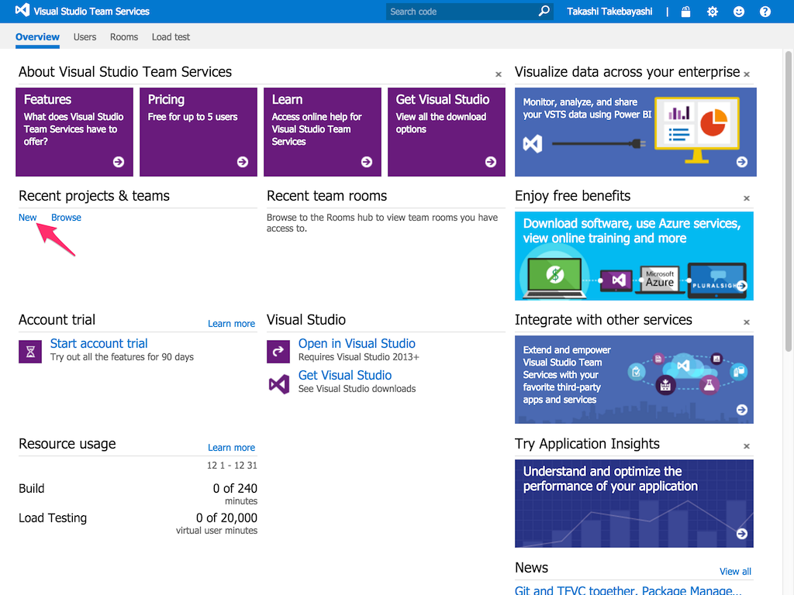
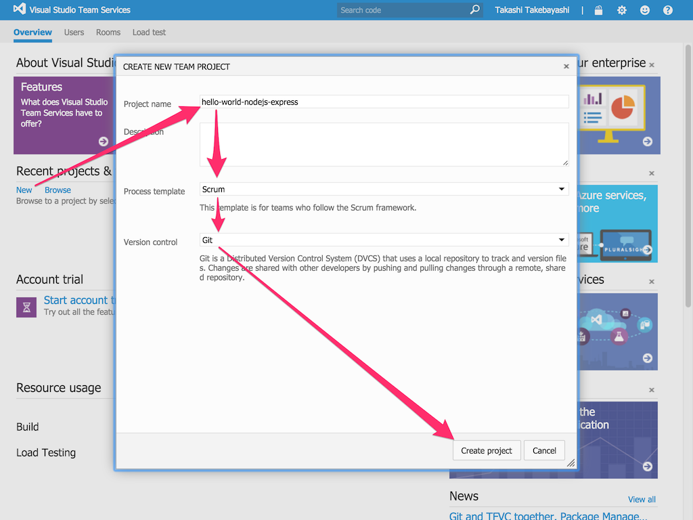
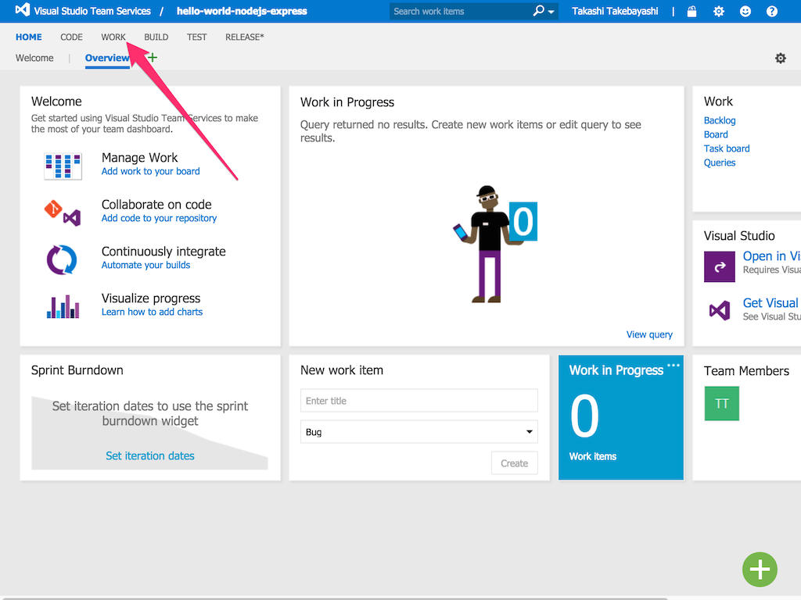
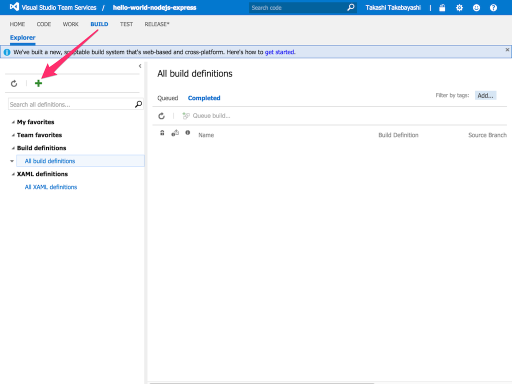
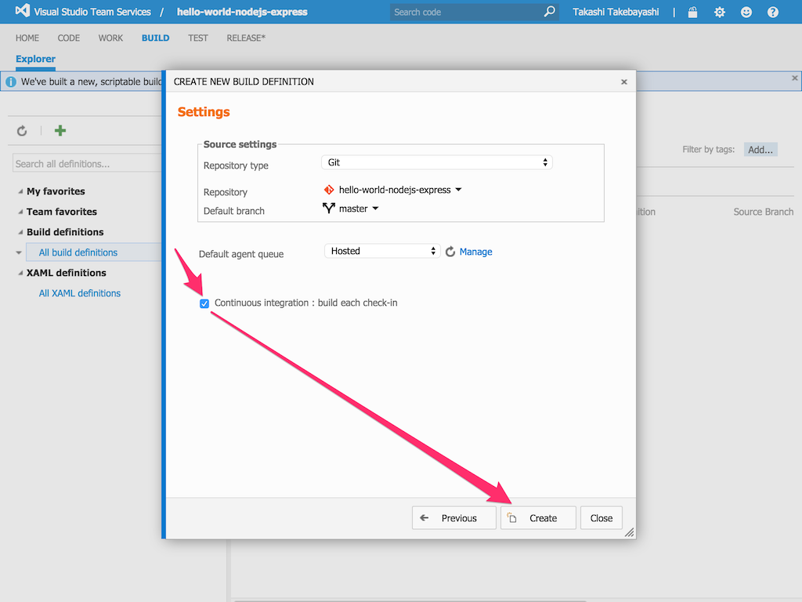
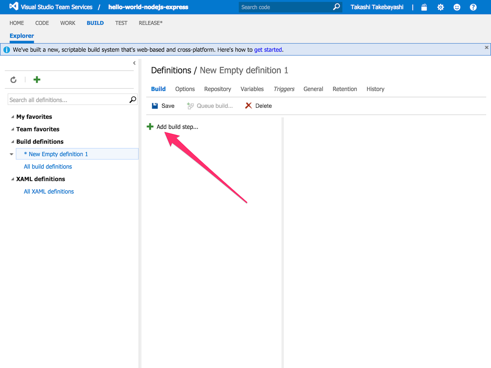
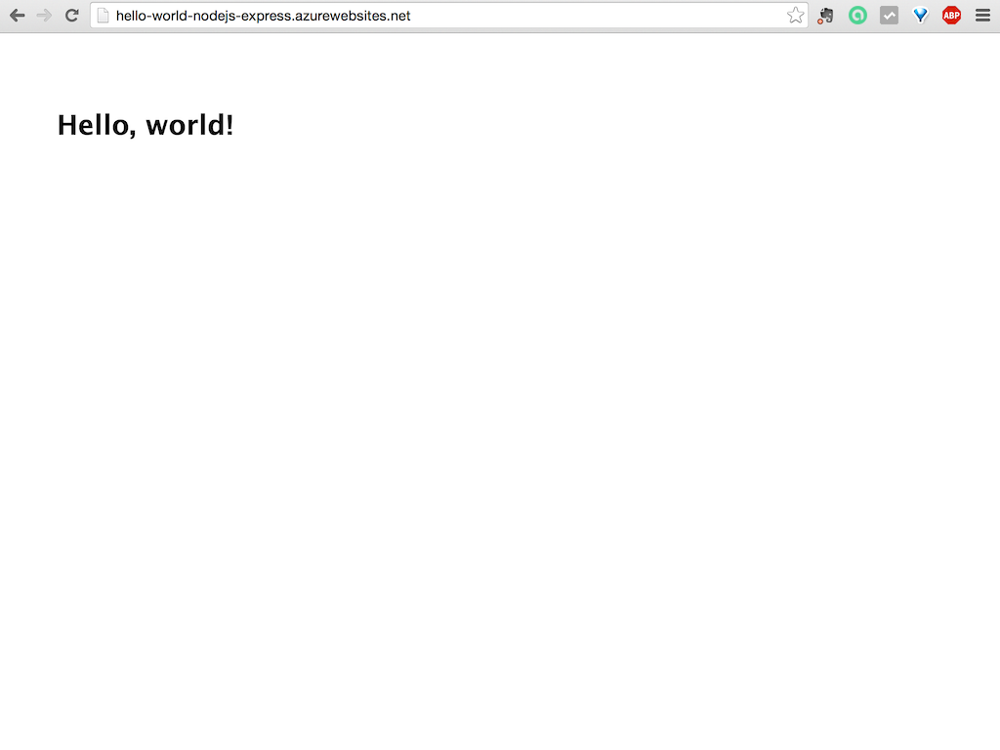
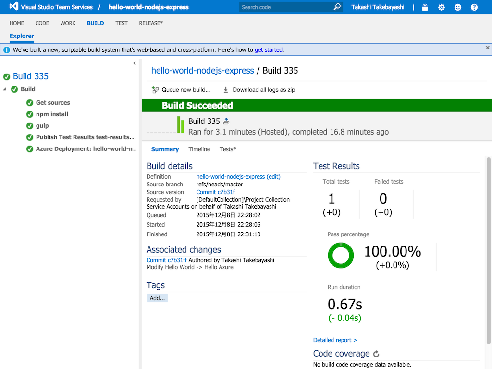

# Developers receive Benefits by using the Visual Studio Team Services

Visual Studio Team ServicesはクラウドベースのALMソリューションです。
Visual Studio Team Servicesはソフトウェア開発のすべての工程で必要となるソリューションを提供します。
Visual Studio Team Servicesを使うと、以下の利点をすべて無料で享受できます。
さらに、Visual Studio Team Servicesには世界のどこからでもアクセスすることができるのです。

* プロジェクトの計画と追跡、問題の追跡
    * バックログとカスタマイズ可能なカンバンボードを使用して、作業のキャプチャ、優先順位付け、追跡を行えます
    * 作業項目は、透過性を確保するためにコードに直接リンクされます
* バージョン管理
    * 無制限に作成できるプライベートリポジトリにコードを保存でき、コードの共同作業を行います
    * 分散バージョン管理にGitを使用し、共同作業を最大化できます
* 自動ビルド、自動テスト、自動デプロイ
    * コード変更後、自動的にアプリケーションをコンパイルし、テストを行う継続的インテグレーション(CI)によって早期に品質の問題を検出できます
    * 継続的デプロイ/デリバリーによって、テストに合格したアプリケーションを自動的にデプロイできます
* プロジェクトのチームメンバーが効率的に作業できるようにコラボレーションツールを提供します
* クラウドベースのロードテストによって、アプリケーションを常に機能する状態に維持できます

それでは、どうすれば使うことができるのか、お見せしましょう。

## Visual Studio Team Servicesにチームプロジェクトを作成する

1. [Visual Studio Team Services](https://www.visualstudio.com/)にサインインします。
2. **New**をクリックします。  

3. **Project name**ボックスにチーム名を入力します。  
**Process template**を選択します。  
**Version control**から**Git**を選択し、**Create project**をクリックします。  
1分程待つと、Visual Studio Team Servicesが新しいチームプロジェクトの作成を終えます。  

4. **Navigate to project**をクリックします。

## Work itemを作成する

1. **WORK**をクリックします。  

2. **+ New item**をクリック後、**Product Backlog Item**をクリックします。  

3. *As a deeveloper, I want to get Visual Studio Team Services's benefits*と入力する。
4. **…**をクリック後、**+ Add task**をクリックします。  
  

5. *Create a build definition*を入力し、リターンキーを押下後、*Management of source code*を入力します。
6. **Create a build definition**をクリック後、番号をメモします。

Tip: "As a deeveloper, …"のような"開発者として…"は厳密にはユーザーストーリーではありません。ここでは説明のためのサンプルとしてこの記述を使っています。

## ビルド定義を作成する

1. **BUILD**をクリックします。
2. **+**をクリック後、**Empty**をクリックし、続けて**Next**をクリックします。  
  

3. **Continuous integration : build each check-in**をクリック後、**Create**をクリックします。  

4. **+ Add build step…**をクリックします。  

5. **Package**をクリック後、**npm**の**Add**をクリックします。  

6. **Build**をクリック後、**gulp**の**Add**をクリックします。  

7. **Test**をクリック後、**Publish Test Results**の**Add**をクリックします。  

8. **Deploy**をクリック後、**Azure Web App Deployment**の**Add**をクリックし、**Close**をクリックします。  

9. **Publish Test Results**をクリックします。
10. **Test Results Files**に*test-results.xml*を入力します。  

11. **Azure Web App Deployment**をクリックします。
12. **Azure Subscription**を選択します。  
使用するサブスクリプションが選択されていることを確認し、サブスクリプションが使用できない場合は、以下の手順でサービスエンドポイントを追加してください。
  1. **Manage**をクリックします。  
  
  2. **New Service Endpoint**をクリック後、**Azure**をクリックします。  
  
  3. Add New Azure Connectionダイアログボックスで:
      1. **Certificate Base**を選択します。
      2. **Connection Name**に名前を入力します。
      3. [ここ](https://go.microsoft.com/fwlink/?LinkId=254432)をクリックし、publishsettings xmlファイルをダウンロード後、ファイルを開きます。
      4. 使用したいサブスクリプションのIDとName、ManagementCertificateの値をファイルからコピーし、それぞれAdd New Azure Connection dialogの項目にペーストします。  
      
      5. **OK**をクリックします。
13. **Web App Name**にWeb Appの名前を入力します。  
Tip: ここであなたが入力した名前は一意か、既に作成済みのAzure Webアプリケーションの名前である必要があります。未作成の名前の場合、AzureはWebアプリケーションを作成し、サブスクリプションに追加します。
14. **Web Deploy Packagee**に*_package/package.zip*を入力します。
15. **Save**をクリックします。  

16. **Name**にビルド定義の名前を入力後、**OK**をクリックします。

## あなたのアプリケーションをアップロードする

1. あなたが**Git**をインストールしていない場合、**Git**をインストールします。  
使用しているプラットフォームのインストール手順については、[Git download page](http://git-scm.com/download)を参照してください。
2. 私のシンプルなNode.jsアプリケーションをダウンロードするため、以下のコマンドを使用します:
    $ git clone https://github.com/changeworld/hello-world-nodejs-express.git
3. 以下のコマンドを使用し、先程クローンしたアプリケーションの更新をVisual Studio Team Servicesに反映するためにのGitのリモートに追加します:
    $ cd hello-world-nodejs-express
    $ git remote add azure https://{your_account}.visualstudio.com/DefaultCollection/_git/{your_team_project}
4. *hello-world-nodejs-express/server.js*ファイルをエディターで開き、空行を追加します。
5. 以下のコマンドを使用し、リポジトリにファイルを追加します:
    $ git add .
    $ git commit -m "Management of source code #{copy the task number}"
6. 以下のコマンドを使用し、Azureにpushします:
    $ git push azure master
7. あなたのチームプロジェクトをブラウザ上で開きます。
8. **BUILD**をクリックします。
9. ビルド成功後、ビルド番号をクリックし、内容を確認します。その後、あなたのWebサイト: http://{your web app name}.azurewebsites.net をチェックしてください。  
  

## あなたのアプリケーションの変更を公開する

1. *hello-world-nodejs-express/routes/index.js*ファイルをエディターで開き、'Hello, world!'を'Hello, Azure!'に変更後、保存します。
2. 以下のコマンドを使用し、Azureにpushします:
    $ git add .
    $ git commit -m "Modify Hello World -> Hello Azure"
    $ git push azure master
3. あなたのチームプロジェクトをブラウザ上で開きます。
4. **BUILD**をクリックします。
5. ビルド成功後、ビルド番号をクリックし、内容を確認します。その後、あなたのWebサイト: http://{your web app name}.azurewebsites.net をリロードします。ブラウザには'Hello, Azure!'と表示されていることをチェックしてください。  
  

